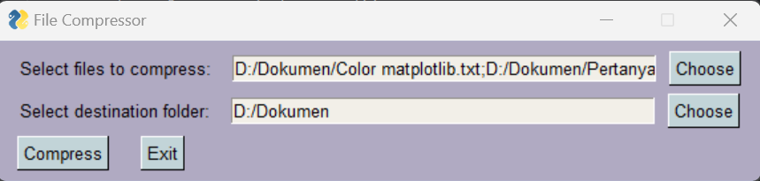
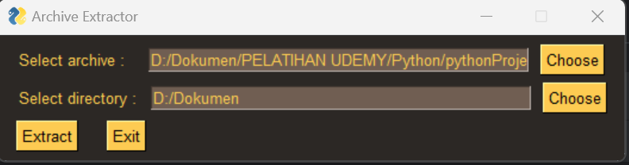

# Python Project of File Compression & Archive Extraction Application

## Project Description

**Problem :**  
Managing and transferring multiple files can become cumbersome due to their size and the need for efficient storage and transportation. To address this issue, there is a requirement for a file compression application that allows users to select multiple files, and compress them into a single ZIP file. Beside that, the user sometimes need to extract the contents of their compressed files efficiently.

**Challenges :**  
Build a Zip File Compression Application that allows users to bundling files together for easier sharing, storage, or backup. Also build file extraction to extract their archive File.

## Project Goal

Provide an intuitive user interface that allows users to select multiple files for compression, and extract the archive file.

## Tools & Library Used

 &nbsp;

## Project Result

[Click here to get full code of file compressor](https://github.com/nickenshidqia/File_Compression_App_Python_Project/blob/1fb447bf403e7c0cab99e8a831e88422bd36c809/compressor.py)  
[Click here to get full code of archive extraction](https://github.com/nickenshidqia/File_Compression_App_Python_Project/blob/4070438dbb4aba50ba02012a88424debf99da4ba/zip_extract.py)

### A. File Compressor Graphical User Interface Based

This is File Compressor Graphical User Interface Based :

- Multiple File Selection  
  Allows users to select multiple files for compression.
- Destination Folder Selection :  
  Enables users to choose a destination folder where the compressed ZIP file will be saved.
- Compression :  
  Implement the ZIP compression to efficiently reduce the size of the selected files.

### B. Archive Extraction Graphical User Interface Based

This is Archive Extraction Graphical User Interface Based :

- Select archive
  Enables users to select a compressed file (e.g., ZIP) for extraction.
- Destination Folder Selection :  
  Enables users to choose a destination folder where the extracted files will be saved.
